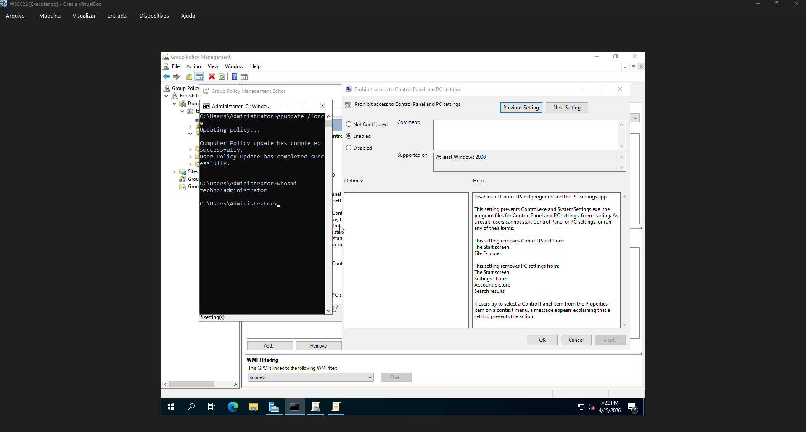
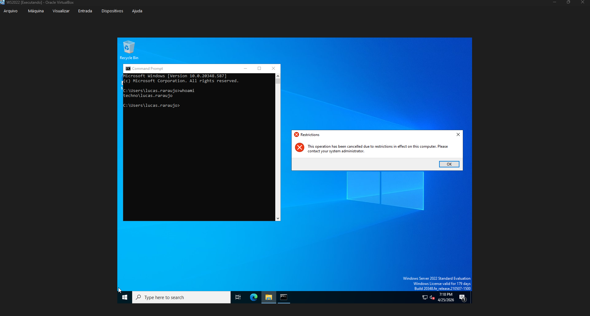
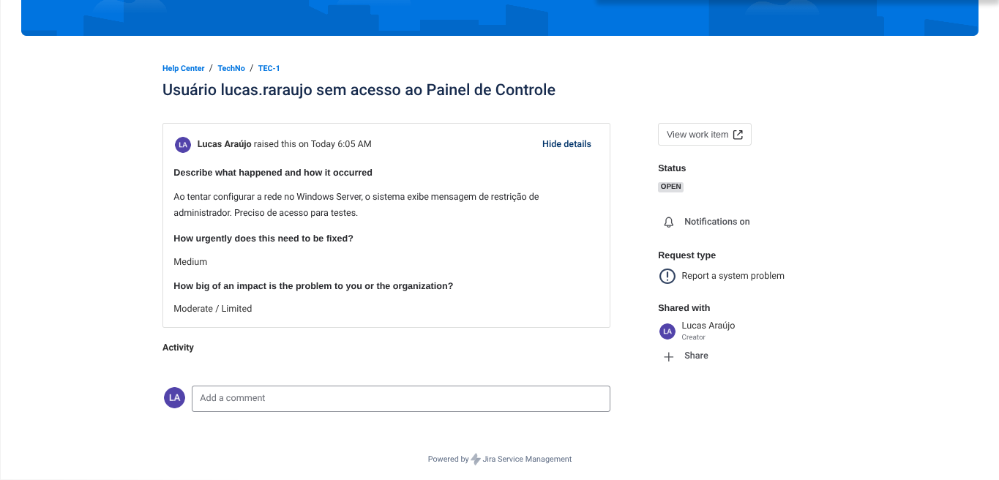
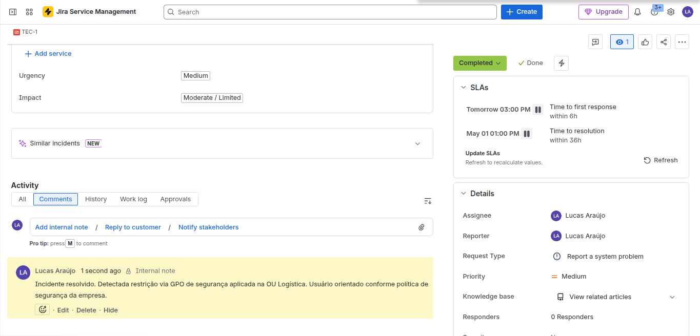
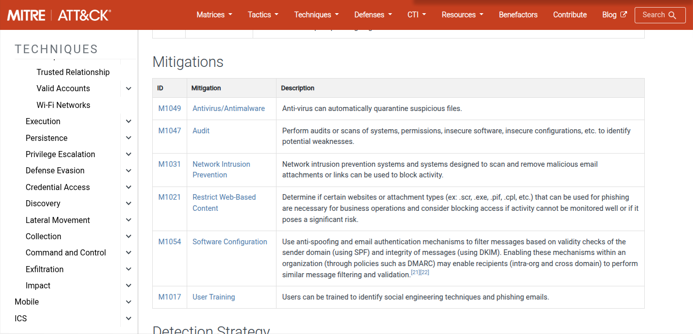
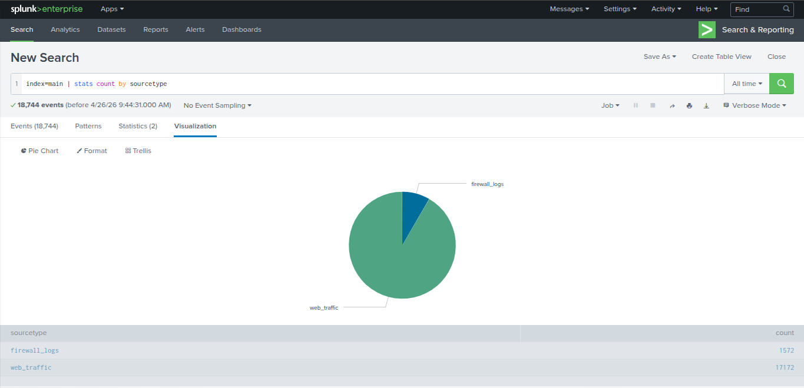
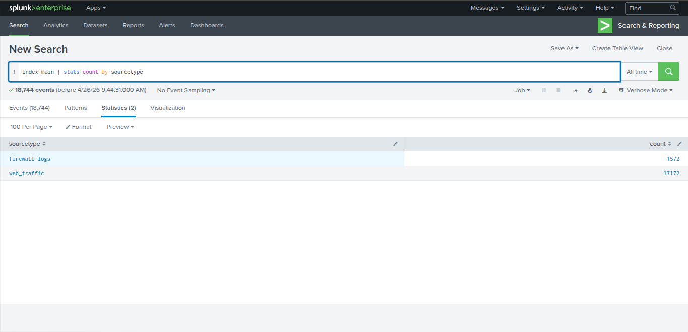
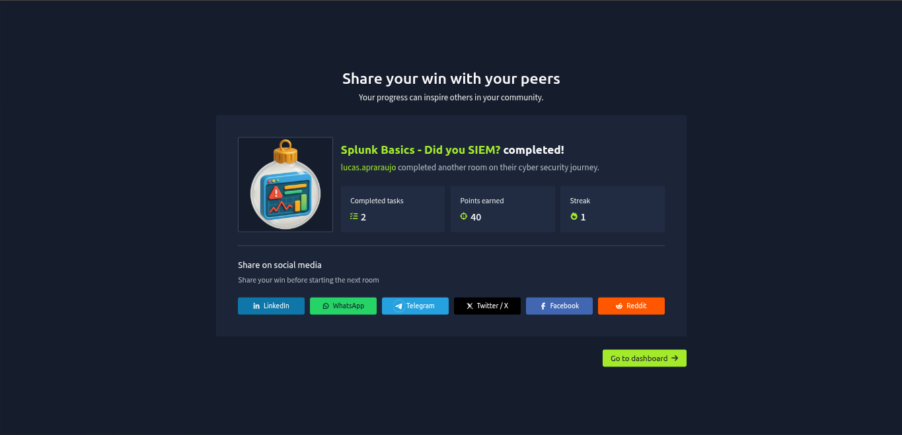

# 🛡️ Home Lab: CyberSecurity & IT Operations
**Projeto prático simulando um ecossistema corporativo completo: da administração de sistemas à detecção de ameaças.**

---

## 📅 Demonstração Técnica

### 1. Windows Server: Active Directory & Hardening
Implementação de um Controlador de Domínio para gestão centralizada de identidades e aplicação de políticas de segurança (GPO).
* **Configuração:** Instalação do AD DS e implementação de GPO de restrição.
* **Controle:** Bloqueio de acesso ao Painel de Controle para usuários comuns.

*Interface de Gerenciamento de Política de Grupo (GPMC).*

*Validação do bloqueio com o usuário "lucas.raraujo".*

---

### 2. Jira: Gestão de Incidentes (Framework ITIL)
Simulação do ciclo de vida de um chamado técnico utilizando o Jira Service Management.
* **Fluxo:** Registro de incidente através do portal do cliente.
* **Resolução:** Atendimento técnico com documentação de causa raiz no encerramento do ticket.

*Chamado aberto pelo usuário relatando a restrição.*

*Ticket concluído com nota técnica interna explicando a GPO.*

---

### 3. MITRE ATT&CK: Inteligência de Ameaças
Uso do framework global para validar as táticas de defesa aplicadas no laboratório.

*Estudo das técnicas de mitigação baseada no MITRE.*

---

### 4. Splunk: Monitoramento e SIEM
Operação em ambiente de SIEM para análise de logs e criação de visualizações de segurança.

*Visualização gráfica comparando tráfego de rede.*

*Resultado da query estatística no Splunk.*

*Conclusão do treinamento prático "Splunk Basics" no TryHackMe.*
